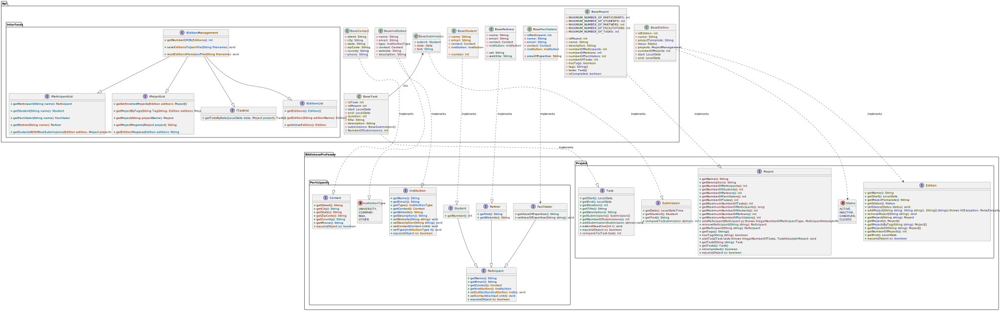

<h1 align="center">Practical Work on Paradigmas de Programação (Programming Paradigms)</h1>

  
  
  

---

<h2>Languages</h2>

 
  	

---

# PP_AC_8220307_8220337
Projeto criado em java para a cadeira de Paradigmas da Programação, no segundo semestre do primeiro ano. 

## Membros do Grupo:
 * Hugo Guimarães

 * Pedro Pinho

## Listagens Distintas:
 * Listar Projetos com base numa tag;
 * Listar os Alunos mais ativos de um projeto em uma edição, tendo como contabilizador o número de submissões;
 * Listagem das tasks para uma determinada data, em um projeto.

## Métodos que deram muito trabalho, e gostariamos que se tivesse em consideração, por favor:
 * AddProject na classe baseEdition;
 * getSudentsWithMoreSubmissions na classe EditionManagement;
 * getProjectByTags na classe EditionManagement;
 * Todos os menus na aplicação.
 * saveEditionsToJsonFile e readEditionsFromJsonFile no EditionManagement, não a conseguimos fazer, mas gastamos muito tempo nelas

## Diagrama de Classe:

